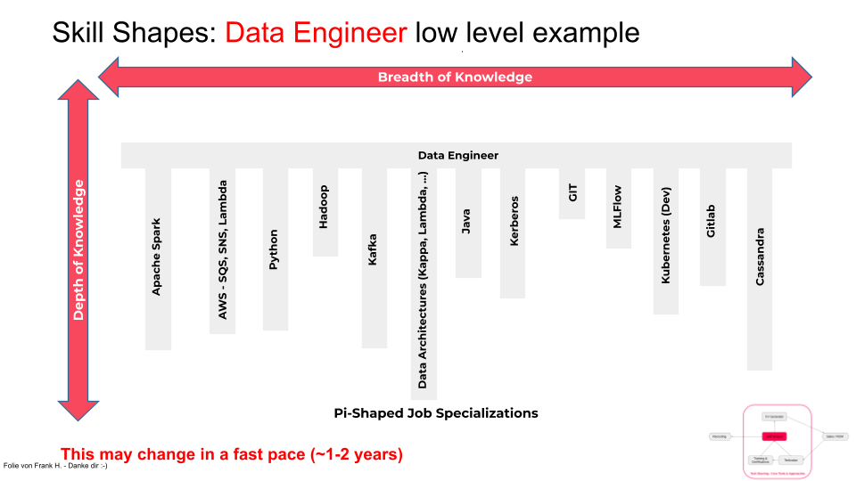

# JHipster SkillShapes

Implementing a MS application that displays the Skill-Shapes of company employees using their CV data.



## Tools (Windows 10)

- [Visual Studio Code](https://code.visualstudio.com/docs/?dv=win)
- [IntelliJ ](https://www.jetbrains.com/idea/download/#section=windows)
- [Windows Terminal](https://www.microsoft.com/de-de/p/windows-terminal/9n0dx20hk701?rtc=1&activetab=pivot:overviewtab)
- [Docker Desktop](https://hub.docker.com/editions/community/docker-ce-desktop-windows/)
- [Chrome](https://www.google.com/chrome/)
- [mvn](https://maven.apache.org/guides/getting-started/windows-prerequisites.html)

## Installation

Use [git](https://git-scm.com/downloads) to clone the repository - branch master.

`git clone https://gitlab.devoteam.de/AB05105/skillshapes.git`

## Configuration

Open your text editor as administrator (writing rights).

Make sure you select all data types when opening the folder.

`C:\Windows\System32\drivers\etc\hosts`

Add the following to map all jhipster services to local.

```
127.0.0.1 keycloak
127.0.0.1 jhipster-registry
127.0.0.1 skillshapes-mariadb
```

## Usage for Local Development

Start keycloak, jhipster-registry and database

`docker-compose -f local-development.yml up -d`

First start microservice application

```
cd microservice
UPDATE src/main/resources/application.properties : quarkus.http.port=8081
```

`.\mvnw compile quarkus:dev -Ddebug=5006`

_Service is available at - localhost:8081/q/dev_

Then start gateway application

`cd gateway`
`mvn`

_Service is available at - localhost:8080_

## Configure Docker service

Build docker images for gateway and microservice

```
cd microservice
UPDATE src/main/resources/application.properties : quarkus.http.port=8080
```

`./mvnw -Pprod clean package -DskipTests`

```
cd gateway
```

`./mvnw package -Pprod verify jib:dockerBuild`

This should have created 2 images gateway and skillshapes/microservice in docker.

## Usage for Dockerized Deployment

Start all applications

`docker-compose up -d`

## Applications:

- [Gateway](localhost:8080)
- [Microservice](http://localhost:8081/q/swagger-ui/)
- [JHipster Registry](http://localhost:8761)
- [Keycloak](http://localhost:9080/)

### Applications and dependencies:

- gateway (SpringBoot gateway application)
- skillshapes (Quarkus microservice application)
- skillshapes's mariadb database

## Logging with ELK Stack & Tracing with Jaeger:

Start elastic search, logstash, kibana and jaegertracing

`docker-compose -f elkstack.yml up -d`

### Kibana

- Go to [Kibana Dashboard](http://localhost:5601)
- Click on Kibana (visualize & analyze) and select _create index pattern_ (bottom).
- Type in "logstash-\*" and click next step.
- Use filter "@timestamp" and click create index pattern.
- Go to discover tab.

### Jaeger

- Go to [Jaeger Dashboard](http://localhost:16686)
- Make requests to the microservice and see the Trace-ID in Response Headers
- Use Trace-ID in Jaeger or Kibana after creating Jaeger Index

## CI / CD

- Working on Jenkins integration (in development)

## What we have now

Working application setup with gateway, microservice, registry, authentication, logging, tracing

- Generated gateway
- Generated microservice
- Entity generation
- JDL import
- ELK Stack running
- Jaeger Open Tracing running
