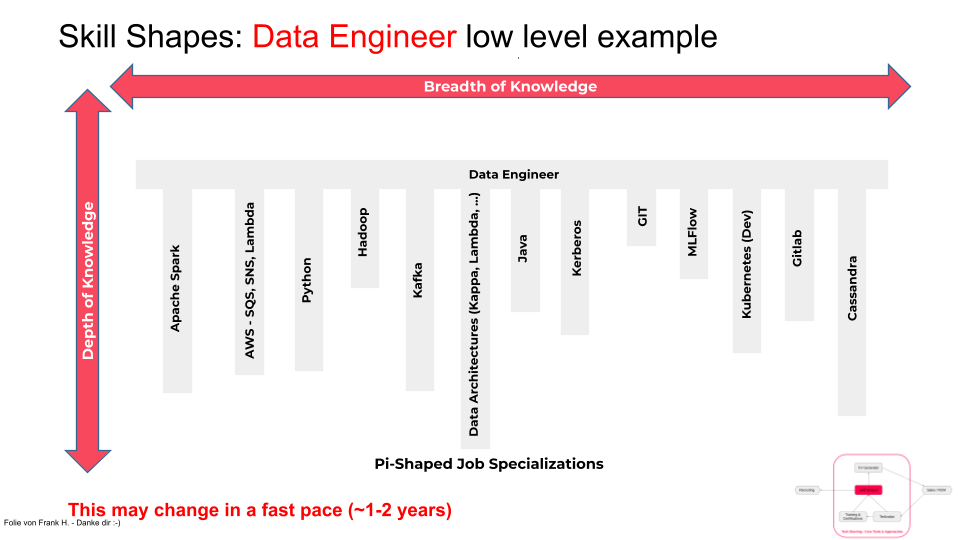
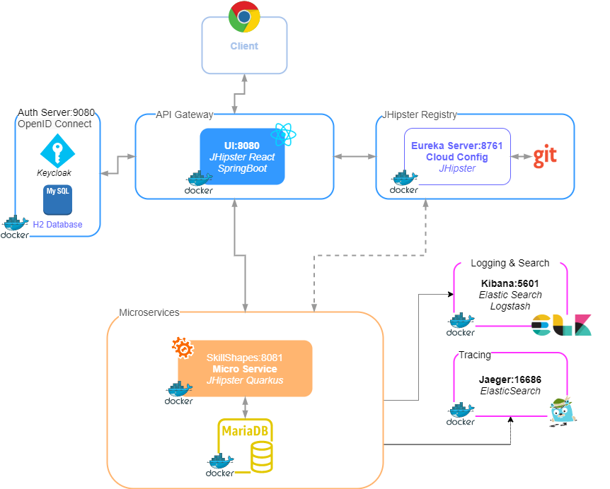

# JHipster SkillShapes

Implementing a MS application that displays the Skill-Shapes of company employees using their CV data.

https://confluence.devoteam.de/display/SKIL/Microservice+Architecture



# Architecture

Microservices using [JHipster](https://www.jhipster.tech/) with:

- **API Gateway (SpringBoot JHipster Application + React)** <br>
  Handles the incoming requests and routing. <br>Communicates with the authentication server keycloak
  and the registry to find the microservices and handle all requests. <br>
  Serves the React Application.
- **Keycloak (Dockerized)** <br>
  Authentication Server using OAuth. Responsible for signing users in and out and managing their auth-sessions.
- **JHipster Registry (Dockerized)** <br>
  Registers all services and serves as a load balancer for request routing. <br>
  Serves as config provider for the applications - config will get pulled from git.
- **Microservice (Quarkus JHipster Application)** <br>
  Backend that handles all the business logic and database queries and requests
- **Elastic Search (Dockerized)** <br>
  Serves as search service to the backend and also for log searches
- **Logstash (Dockerized)** <br>
  Collects and transforms all log data sent from the backend
- **Kibana (Dockerized)** <br>
  Visualization tool for logs
- **Jaeger (Dockerized)** <br>
  Visualization tool for backend actions mapped to requests



## Tools (Windows 10)

- [Windows Terminal](https://www.microsoft.com/de-de/p/windows-terminal/9n0dx20hk701?rtc=1&activetab=pivot:overviewtab)
- [Docker Desktop](https://hub.docker.com/editions/community/docker-ce-desktop-windows/)
- [Chrome](https://www.google.com/chrome/)

### Developer Tools (Recommended)

- [Visual Studio Code](https://code.visualstudio.com/docs/?dv=win)
- [IntelliJ ](https://www.jetbrains.com/idea/download/#section=windows)
- [mvn](https://maven.apache.org/guides/getting-started/windows-prerequisites.html)
- [node](https://nodejs.org/en/download/)

## Installation

Use [git](https://git-scm.com/downloads) to clone the repository - branch master.

```sh
git clone https://gitlab.devoteam.de/AB05105/skillshapes.git
```

> **Note**: If your git clone is not working make sure you are in the VPN. <br>
> If you continue to have problems add the following to your hosts file.

> C:\Windows\System32\drivers\etc\hosts
>
> ```sh
> # Gitlab
> 10.99.70.40 gitlab.devoteam.de
> ```
>
> If the problem still persists please contact the team.

Install Java

Please make sure you have [Java 11+](https://www.oracle.com/java/technologies/javase/jdk15-archive-downloads.html) installed.

```sh
java --version

java 15.0.2 2021-01-19
Java(TM) SE Runtime Environment (build 15.0.2+7-27)
Java HotSpot(TM) 64-Bit Server VM (build 15.0.2+7-27, mixed mode, sharing)
```

Install GraalVM

Please install the [graalvm](https://www.graalvm.org/downloads/).
Quarkus tailors your application for GraalVM. Amazingly fast boot time, incredibly low RSS memory (not just heap size!) offering near instant scale up and high density memory utilization in container orchestration platforms like Kubernetes.

[Configure](https://quarkus.io/guides/building-native-image#configuring-graalvm) it accordingly and set **JAVA_HOME** to the graalvm directory or add it to your path.

## Configuration

Open your text editor as administrator (writing rights).

Make sure you select all data types when opening the folder.

```
C:\Windows\System32\drivers\etc\hosts
```

Add the following to map all jhipster services to local.

```sh
127.0.0.1 keycloak
127.0.0.1 jhipster-registry
127.0.0.1 skillshapes-mariadb
```

## Run the applications

> **Note**: Please make sure you have [Docker Desktop](https://hub.docker.com/editions/community/docker-ce-desktop-windows/) installed.
> Check out the tools section if you have not prepared your environment..

1. #### Start keycloak, jhipster-registry and database
   ```sh
   docker network create skillshapes-network
   docker-compose -f local-development.yml up -d
   ```
2. #### Start ELK Stack, Elastic Search, Logstash, Kibana and Jaeger Tracing
   ```
   docker-compose -f elkstack.yml up -d
   ```

### Run microservice application

```sh
cd microservice
.\mvnw compile quarkus:dev -Ddebug=5006
```

Connect to [http://localhost:8081/q/dev](http://localhost:8081/q/dev)

### Run gateway application

```sh
cd gateway
.\mvnw
```

Connect to [http://localhost:8080](http://localhost:8080)

### (Optional) Frontend Development

> **Note**: This step is **optional** and only for frontend development.
> It will start the server for the frontend application and serve it on a different port (9000 or 900\*).

```sh
cd gateway
npm install
npm start
```

Connect to [http://localhost:9000](http://localhost:9000) or [http://localhost:9002](http://localhost:9002) or other port.

## Applications when running successfully:

- [Gateway](localhost:8080)
- [Microservice](http://localhost:8081/q/swagger-ui/)
- [JHipster Registry](http://localhost:8761)
- [Keycloak](http://localhost:9080/)

### Credentials

- admin:admin
- user:user

### Kibana

- Go to [Kibana Dashboard](http://localhost:5601)
- Click on Kibana (visualize & analyze) and select _create index pattern_ (bottom).
- Type in "logstash-\*" and click next step.
- Use filter "@timestamp" and click create index pattern.
- Go to discover tab.

### Jaeger

- Go to [Jaeger Dashboard](http://localhost:16686)
- Make requests to the microservice and see the Trace-ID in Response Headers
- Use Trace-ID in Jaeger or Kibana after creating Jaeger Index

## CI / CD

- Working on Jenkins integration (in development)

## What we have now

Working application setup with gateway, microservice, registry, authentication, logging, tracing

- Generated gateway
- Generated microservice
- Entity generation
- JDL import
- ELK Stack running
- Jaeger Open Tracing running

## Troubleshooting

### Docker Push Execution Error on Build

If there is an error 'Execution of docker push' skip it and make sure the image exists in your docker environment. It should be there.

```sh
 Failed to execute goal io.quarkus:quarkus-maven-plugin:1.11.3.Final:build (default) on project skillshapes: Failed to build quarkus application: io.quarkus.builder.BuildException: Build failure: Build failed due to errors
[ERROR]         [error]: Build step io.quarkus.container.image.docker.deployment.DockerProcessor dockerBuildFromJar threw an exception: java.lang.RuntimeException: Execution of 'docker push skillshapes/microservice:latest' failed. See docker output for more details
```

### Docker cannot start service

```sh
ERROR: for keycloak Cannot start service keycloak: error while creating mount source path '/run/desktop/mnt/host/c/Users/HL05475/Documents/Projekte/Cloud-Testing/skillshapes/keycloak-db': mkdir /run/desktop/mnt/host/c: file exists

ERROR: for jhipster-registry Cannot start service jhipster-registry: error while creating mount source path '/run/desktop/mnt/host/c/Users/HL05475/Documents/Projekte/Cloud-Testing/skillshapes/central-server-config': mkdir /run/desktop/mnt/host/c: file exists

```

Delete failed images / containers, kill all docker processes and restart docker entirely.

### Port already in use, can not bind

[https://stackoverflow.com/questions/39632667/how-do-i-kill-the-process-currently-using-a-port-on-localhost-in-windows](https://stackoverflow.com/questions/39632667/how-do-i-kill-the-process-currently-using-a-port-on-localhost-in-windows)

```sh
netstat -ano | findstr :<PORT> (8080,8081,8761 etc.)
taskkill /PID <PID> /F

```

# Project Contacts

- Andreas Brust (Competence Lead / Product Owner) - andreas.brust@devoteam.com
- Can Saner (Backend Development) - ahmet.can.saner@devoteam.com
- David Minkovski (Full Stack & Microservice Orchestration) - david.minkovski@devoteam.com
- Severin Koch (Frontend Development) - severin.koch@devoteam.com
